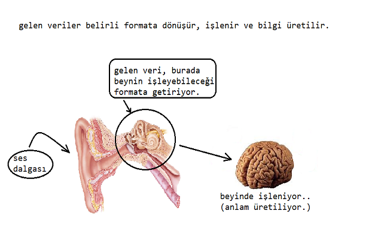

> önceki derslerde öğrendiğimiz bilgileri hep tekrarlayacağız.

### Algoritma Nedir ?

Algoritma, bir problemi çözmek için izlenen `sıralı`,`mantıklı` ve <u>kesin</u> bir hüküm bildiren *adımlar bütününe* denir.

* Algoritma oluştururken bu temel adımları gözetmeliyiz

---

### Veri Nedir, Bilgi Nedir ?

#### Veri:

* Dış dünyadan gelen ham sinyallere `veri` denir.

>Örneğin: ses, koku, sıcaklık gibi duyular veri olabilir.

* ham haldedir. Yani bir işlemden geçmemiştir.

#### Bilgi:

* Verilerin `işlenmiş` ve `anlamlandırılmış` haline bilgi denir.
	  
“Dışarıdan gelen ses titreşiminin kulak zarından beyne iletilmesi ve beynin bu veriye anlam yüklemesi `bilgi`ye örnektir.”
	  
dış dünyadan bilgisayara gelen sinyalin işlemcide işleme geçip
ses, video veya döküman dosyası olduğunu bulmak bilgidir.

---

### Peki veri yapısı nedir ve neden buna ihtiyaç duyuyoruz ?
	  
* gelen her bir verinin `ölçme`,`sınıflandırma` ve ihtiyaç
olunduğuna `kolayca ulaşma` işlemine <u>veri yapıları</u> denir. 
	  
* veri yapıları hayatın her yerindedir.
	  
örnek olarak: 

>bir arama motoru üzerinden (Google,Yandex,Firefox) 
>bir bilgiye ulaşılmak istendiğinde bir saniyenin altında 
>sonuçların bulunması ve sıralanıp kullanıcıya ulaşması
>veri yapıları sayesinde olur.  
	  
_yapay zeka ve akıllı robotlar veri yapıları ile çalışır. Girilen sorular analiz edilir, çözüm aranır ve kullanıcıya sunulur._

  **Author:** Berat Kurt 

  burayı güzelce anlayıp bitirdikten sonra `Veri türleri`ni öğrenmeye geçebiliriz.

`Veri Türleri.md` dosyasına girmek için [buraya](./texts/Veri%20Türleri.md) tıklayınız.

Kaynak kodları için [buraya](./Başlangıç.java) tıklayınız.

Sonraki ders için [buraya](../ders01/) tıklayınız.