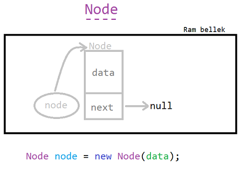
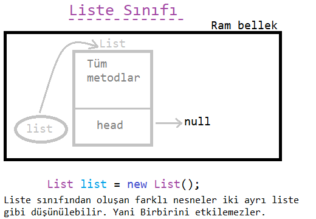
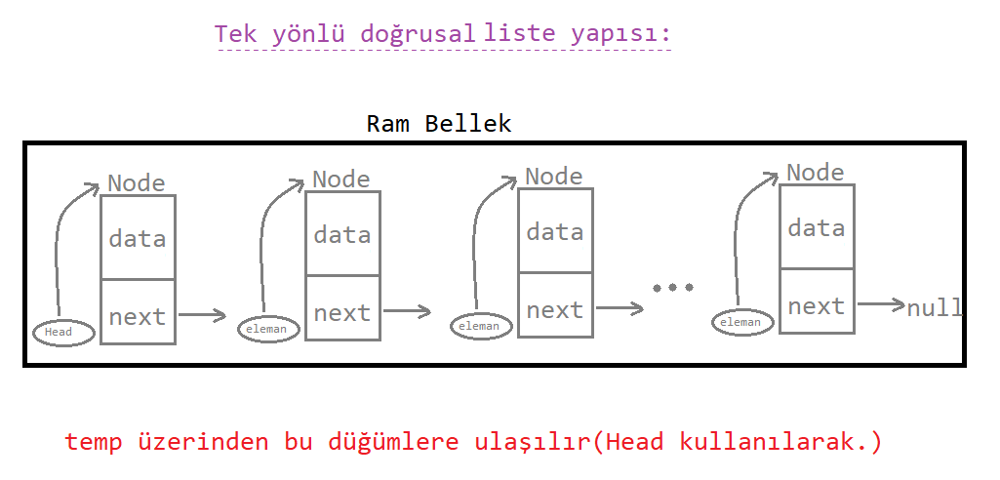

### Önceki Konularda İşlediklerimiz:

* Veri, bilgi ve algoritama kavramı,

* Liste kavramı, doğrusal ve bağlı olan türleri,

* Java ve nesne yönelimli programlama hakkında birkaç önemli bilgi.

* Birkaç örnek...

> Şimdi ise işlenecek olan `bağlı liste` çeşitlerine beraber bakacağız.

---

* 4 tane liste çeşidimiz vardı:
  
- Tek Yönlü Doğrusal Bağlı Liste: <u>TYDoBL</u>
- Çift yönlü Doğrusal Bağlı Liste: <u>ÇYDoBL</u> 
- Tek Yönlü Dairesel Bağlı Liste: <u>TYDaBL</u>
- Çift yönlü Dairesel Bağlı Liste: <u>ÇYDaBL</u>

bugün <u>TYDoBL</u> yapısını inceleyeceğiz.

---

### Temel kavramlar ve önsöz:

Bir soruya getirilen bir çözüm, başka soruların ortaya çıkmasına neden olur.

* İlk seferde düğüm yapısını tanımlarken farklı sınıflar ve nesneler üzerinden ilerledik.

* Sonra fikrimizi geliştirip, düğümleri `tek sınıf tipinden türetilen nesneler` üzerinden ifade ettik,

şimdi de bu fikrimizi bir adım daha ileri taşıyacak özellikleri ve metodları beraber oluşturacağız.

---

## 1. Node(düğüm):


  * verileri tutan ve kendinen sonraki düğüme işaretleme yapacak olan nesnelere, yani `bağlı liste elemanı`na denir.

  * her bir düğüm, içerisinde <mark>veri</mark> ve <mark>gösterici</mark> tutar.

  * Düğüm içerisinde constructor(yapıcı) metod bulunur.

  * Kendinden sonraki işaretçi değeri varsayılan olarak `null` seçilir.

---

```java
public class Node {
    int data;
    Node next;
    Node (int data) {
        this.data = data;
        next = null;
    }
}
```

Şeklinde olur. Görsel olarak da:

---



---

Bu şekildedir.

## 2. Liste Sınıfı:

Liste sınıfı içerisinde bulunan metodlar sayesinde bir `Liste nesnesi `oluşturup, metodlar aracılığı ile :

`ekleme`, `çıkarma`, `liste verilerini ekrana yazdırma` vs.
işlemleri yapılabilir.

### head (baş düğüm):

* Bağlı listeye eklenen *ilk düğümü* tanımlar ve eklenecek olan düğer tüm düğümler, **baş düğüm esas alınarak** sonraki düğümlere <u>eklenir</u>. 

* Baş düğüm çok önemlidir, baş düğüm kaybolursa Liste de kaybolmuş olur. İşlemler baş düğüm üzerinden yürütülür, `bağlı listenin temelidir`.

* Liste ilk tanımlandığında, baş düğüm varsayılan olarak `null` değerliklidir.

```java
public class List {
    Node head;
    List() {
        this.head = null;
    }

}
```

Şeklinde olur. Görsel olarak da:

---



---

Bu şekildedir.

> baş düğüm -veri gizliliği ve güvenliği açısından- genellikle <u>private</u> olarak tanımlanır.

----
### Düğüm oluşturma - Obj( ) metodu:

* ekleme işlemleri için bu metod `düğüm` oluşturur.

* değer döndüren bir metod oluşturacağımız için dönüş tipi `Node` türünden olmalıdır.

* eklenecek olan veriyi içerisine `parametre` olarak alır.

```java
public class List {

    Node obj(int data) {
        Node eleman = new Node(data);
        return eleman;
    }

}
```

### temp (dolaşım düğümü):

* ekleme, çıkarma, yazdırma, veya n. sıradaki düğümü tutma gibi tüm özellikler temp düğümüne geçici süreliğine atanır.

* temp olmazsa olmaz bir yapıdır.

### Düğüm ekleme metodu:

* Bu metod her çalıştığında listemize düğüm eklemesi yapacak. 

* Ekleme işlemi hep `son sıraya doğru` gerçekleşecek.

>Dikkat:

* eğer liste `boşsa` -yani düğüm yoksa- baş düğüm veri tutacak,

* eğer liste `boş değilse` -yani en az bir düğüm varsa- <u>temp</u> kullanılarak son düğüm bulunacak ve sağına ekleme yapılacak.

```java
public class List {

    void sonaEkle(int data) { 
        //sona ekleme işlemini yapan fonksiyon.
        //(içerisinde parametre olarak veri/verileri alır.)
        
        if(head == null) {  //liste boşsa,
            head = obj(data);
            System.out.println("Liste oluşturuldu ve ilk düğüm eklendi.");
        }
        else {  //liste boş değilse
            Node temp = head;
            while(temp.next != null) {
                temp = temp.next;
            }
            temp.next = obj(data);
            System.out.println("Listenin sonuna düğüm eklendi.");
        }
    }
}
```

Görsel olarak:

---



---

bu yapı kurulacaktır.

* Kaynak kodlarına bknz. Örnek soru, kaynak kodlarda bulunacaktır.

* Örnek soru cevabınının görseli için [buraya](./images/örnek.png) tıklayınız.

* Sonraki ders için [buraya](../ders03/) tıklayınız.

**Author:** Berat Kurt

