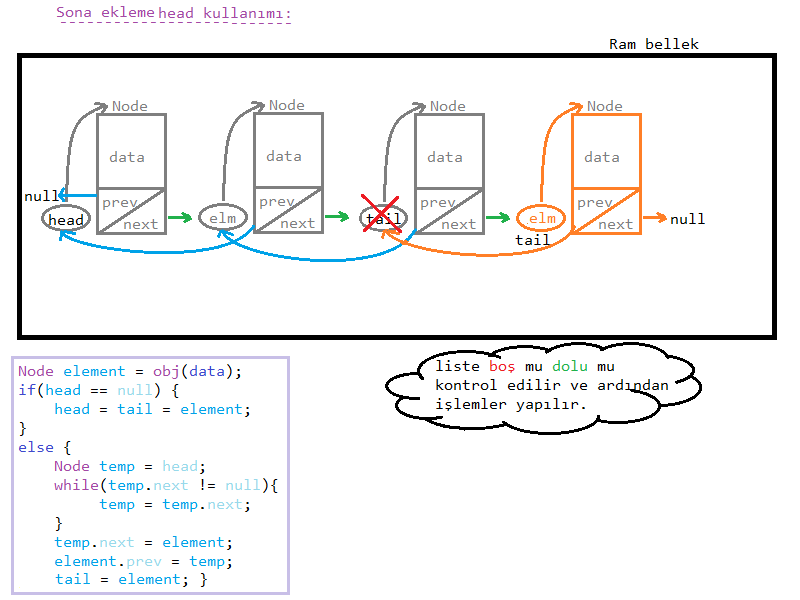
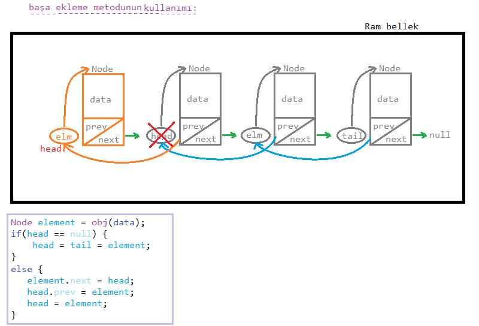
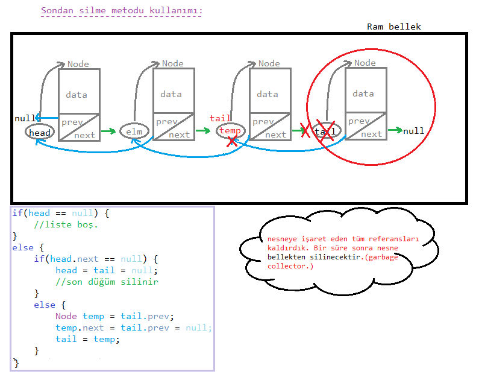
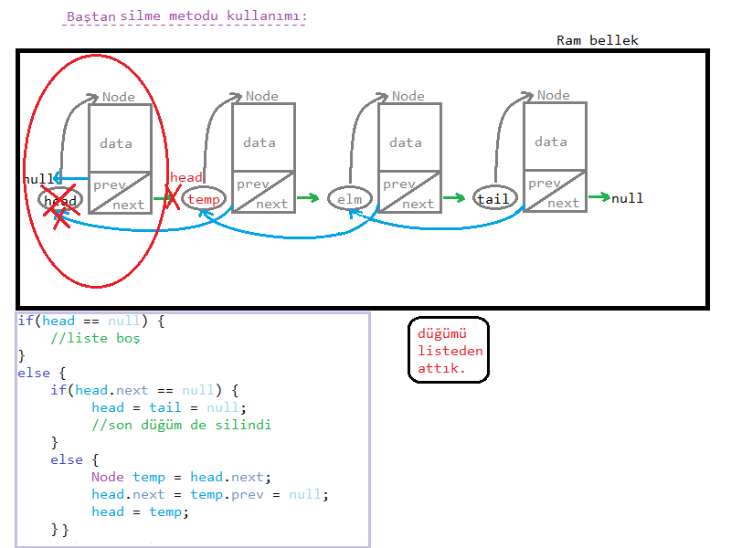

## Çift Yönü Bağlı Liste Nedir ?

* bir düğümün ` iki tane göstericisi` olduğu ve birinin <mark>sonraki(next)</mark>, diğerinin <mark>önceki(prev)</mark> düğümü gösterdiği yapıya denir.

* Tek yönlü bağlı listelerde her bir düğüme yanlızca next(sonraki) göstericisi ile gidilebiliyodu. Şimdi ise bir düğüm üzerinde `hem ileri`, `hem geri` gidebilecek bir düğüm yapısı tasarlayacağız.

* Çift yön, bağlı listelerde bizlere çok fazla esneklik ve seçenek sunar.

**En Çok Nerede Kullanır ?**

* şarkı uygulamaları,

* arama motoru üzerinde önceki ve sonraki sayfaya yönlendiren tuşlar 

örnek olarak verilebilir.

---


* görsel olarak aşağı yukarı böyle görünür :) 

### Ekstra özellikler:

* <u>tail (kuyruk):</u> listenin son düğümünü tutar.

* <u>head (baş):</u> -bildiğimiz üzere- listenin baş düğümünü tutar

* <u>prev (previous - önceki):</u> kendinden önceki düğümü tutan göstericidir.

* <u>next (sonraki):</u> kendinden bir sonraki düğümü tutan göstericidir.

> şimdilik başaEkle, sonaEkle, baştanSil, sondanSil, verileri yazdırma işlemleri göreceğiz.

**Çift yönlü bağlı listede algoritmaların iki şekilde de kurulabileceğini unutmayınız.**

---

### Node Kurulumu:

oluşturacağımız tüm düğümleri temel alan sınıfın şablonu:

```java
public class Node {
    int data; //tutulacak veri
    Node next, prev;

    Node(int data) {
        this.data = data;
        next = prev = null;
    }
}
```

şeklinde olacaktır.

---

### Liste Kurulumu:

bir liste oluşturulurken kurulacak metodlardan önce `baş ve son düğüm` tanımlanır:

```java
public class List {
   private Node head, tail;

    List() {
        head = tail = null;
    }
}
```

liste ilk oluşturulduğunda varsayılan olarak `null` değerlikli olacaktır.

---

### Düğüm Oluşturma obj(); Metodu:

bu metod, parametre olarak verileri alıp bizlere bir düğüm döndürecektir.

veri gizliliği açısından `private yapılır`.

```java
private Node obj(int data) {
    Node element = new Node(data);
    return element;
}
```

---
### Sona ekleme metodu (head kullanımı):



---
yukarıda görmüş olduğumuz `yapıda tail' e ihtiyaç kalmaz`. Çünkü tail düğümünün yapacağı işi `temp` devralır.

*eğer tail içeren yapı kurmak istiyorsak:*

```java
public class List { 
    void addLast(int data) {
        Node element = obj(data);
        if(head == null) {
            head = tail = element;
            System.out.println("Liste oluşturuldu ve ilk düğüm eklendi.");
        }
        else {
            tail.next = element;
            element.prev = tail;
            tail = element;
            System.out.println("Sona düğüm eklendi."); 
        }
    }
}
```
> şeklinde yapacağız. Ben de algoritmaları kurarken kısa yollardan kuracağım.

### Başa ekleme metodu:



---

* keyfinize göre `temp'li` kullanımı da seçebilirsiniz.
* temp'li kullanım nasıl olacak diye sorabilirsiniz. Tabiki `tail kullanarak` olacaktır.

*başa ekleme -tail kullanımı-*

```java
public class List {
    void addLast(int data) {
        Node element = obj(data);
        if(head == null) {
            head = tail = element;
        }
        else {
            Node temp = tail;
            while(temp.prev != null) {
                temp = temp.prev;
            }
            element.next = temp;
            temp.prev = element;
            head = element;
        }
    }
}
```
farklı yöntemler keyifli olacaktır.

**baştan/sondan silme işlemleri için aynı bu yapı kullanılabilir ama kullanışlı olması açısından kısa yollardan gideceğiz.**

> dikkat ederseniz <u>bir başlangıç yada bir bitiş</u> düğümüyle bile  veri yapıları kolayca tanımlanabiliyor.

### Sondan Sİlme Metodu:



> tail'e ihtiyaç duymuyorsanız `temp`'li kullanım yapabilirsiniz.

---

## Baştan silme metodu:



#### ÖDEV:

> `ekrana düğümleri yazdırma` ve `düğüm sayısını döndürme` metodlarını kendiniz <u>iki farklı şekilde</u> oluşturunuz.

ödevi karşılaştırmak için [ÖDEV.md](./texts/ÖDEV.md) dosyasına bknz.

**Author:** Berat Kurt

---


sonraki ders için [buraya](../ders10/) tıklayınız.

