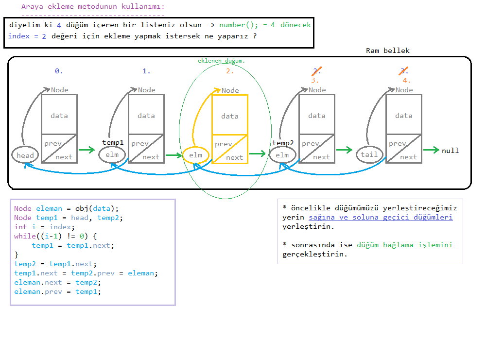
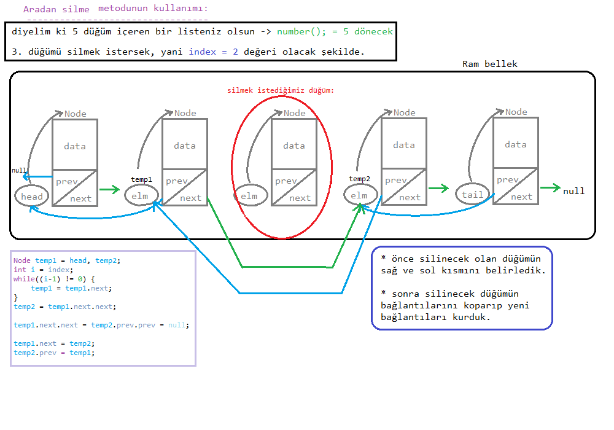

## ARAYA DÜĞÜM EKLEME-SİLME İŞLEMİ:

* önceki yapıları dikkate alarak metodların <u>indeks</u> parametrelerinin de olacağını unutmayınız.

* <u>sorulması gereken temel sorular arasında:</u>

>indeks `doğru yazılmış mı`, `liste boş mu`, `indeks geçerli aralıkta mı` ? gibi sorular sormamz gerekecek.

### Araya ekleme: addBetween metodu:

|||
|-|-|
|1. soru:|indeks değeri doğal sayı mı?|
|2. soru:|indeks değeri geçerli aralıkta mı?|
|3. soru:|indeks değeri `son` veya `ilk sıra` değerini mi almış?|

* sonra da araya ekleme işlemi ne gerektiriyorsa o yapılır.

> eğer aradan çıkarama işlemi yapıyorsak, o zaman 2. sorunun yerine 
`"Liste boş mu ?"` diye bir soru sorabiliriz.

#### addBetween kullanımı:

şeklinde uygulanır. 

> Şekilden de az çok birşeylerin anlaşılacağını düşündüğüm için açıklama gereği duymayacağım.

---

#### deleteBetween kullanımı:

---

* bir sonraki derste Arama motorlarında bulunan sayfalar arası geçiş yapan güzel bir Algoritma yapısı kullanmayı planlıyorum. 

* Şimdilik en baştaki işlediğimiz konulara kadar <u>tekrar</u> ediniz :)

* Yada iyi bir şekilde öğrendiğinizi düşünüyorsanız [Sonraki derse](../ders11/) geçebiliriz.

**Author:** Berat Kurt