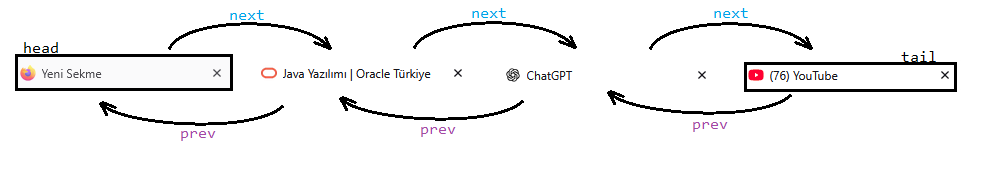
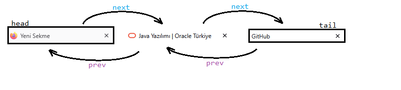

<font face="chinese rocks" color="yellow"><h2>Sayfalar arası geçiş Programı:</h2></font>

* Bu örneğimizde <u>Çift yönlü doğrusal bağlı liste</u> yapısını kullanarak 
Google veya Firefox gibi tarayıcı uygulamalarında bulunan sayfalar arası geçiş
özelliğinin algoritmasını kuracağız.

* veri yapılarında sayfalar arası geçiş, tarayıcıyı ilk açtığınızdan itibaren tarayıcı arayüzünü, `içerdiği bilgileri vs` bellekte tutar. Ardından girdiğiniz her bir sonraki site için çift yönlü bağlı liste yapısı kurulur.

>Örneğin:



---

* Sayfada geriye giderseniz ve `başka sitelere giriş yaparsanız` sonraki sayfalarda bulunan site verileri <u>kaybolur</u>.

>Örneğin:

* yukarıdaki resimde ana sayfa ekranından YouTube'a kadar bulunan site veri yapısı bulunmaktır.

* eğer iki sefer `prev(geri)` gidip başka siteye giriş yaparsak artık veri yapısı:



---

şeklinde olacaktır. (GitHub'a girdiğimizi varsayalım.)


<font face="chinese rocks" color="yellow"><h2>Gereken Metod ve Yöntemler:</h2></font>

**Node için:**

* ileri geri işaretleyici `next`, `prev`

* `String` türünden site içeriği.

* `String` türünden site başlığı

* bulunduğun siteyi tutan düğüm: `here` olacak.

>Örneğin:

```java
public class Node {
    Node next, prev, here;
    String title;       //sitenin ismini tutmak için kullanılabilir.
    String contents;    //site içeriğini iki kelime ile özetlemek yeterlidir.
    Node (String title, String contents) {
        this.title = title;
        this.contents = contents;
        next = prev = here =null;
    }
}
```

**List için (WebPage):**
* head, tail bulunmalıdır ve varsayılan olarak `Anasayfayı` göstermelidir.

```java
public class WebPage {
    Node head, tail;
    WebPage() {
        head = tail = obj("Bu bir Firefox/Google/Bing Anasayfasıdır...");
        // artık hangi tarayıcıyı kullanıyorsanız :)
    }
}
```
---

#### 1. webSite(); metodu:

* bu metod `obj();` metoduyla birebir aynı çalışır.

* içerdiği, parametreye bağlı olarak oluşturur ve websiteyi belleğe alır.

```java
public class WebPage {
    Node webSite(String contents) {
        Node site = new Node(contents);
        return site;
    }
}
```

Şeklinde olacaktır.

#### İleri/Geri gitme metodları PREVIOUS(); - NEXT(); :

* tarayıcılarda bulunan:


ileri-geri düğmeleriyle birebir aynı çalışan bir metod olacak.

* eğer bulunduğumuz sitenin ilerisinde veya gerisinde  başka siteler bulunuyorsa `kullanılabilir.`

