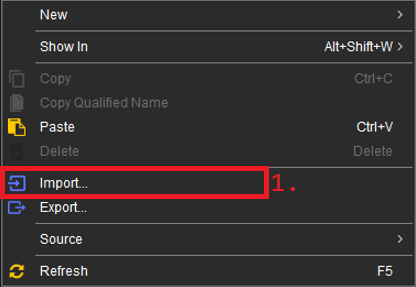

## Kullanım Klavuzu:

* Bu depo %100 Java programlama dili ile tasarlanmıştır. Diğer programlama dilleri, <u>sadece</u> 
konuyu daha rahat öğrenmek için bazı örneklerde verilmiştir.

* Depomuz `Eclipse IDE` geliştirme ortamı kullanılarak yazılmıştır. Eclipse proje hiyerarşisi: `src` 
ve `bin` klasörlerinden oluşmaktadır.

---

|||
|-|-|
| src | Kaynak kodların `yazı` hâlini tutan klasördür. |
| bin | Kaynak kodların `derlenmiş` hâlini tutan klasördür. |

---

    GitHub, yanlızca java kaynak kodlarını ve temel proje bilgilerini içerisinde tutar. 
    içerisinde src, lisans bilgileri, proje ayarı bilgileri, images(fotoğraf) dosyaları
    README.md dosyası, kaynak kodları ve .md uzantılı dosyaları tutan text klasörleri bulunur.

* kaynak kodları , `src` dosyasının içinde `derslere` ayrılmıştır.

* her bir dersin içinde açıklama dosyaları, fotoğraf ve kaynak dosyaları bulunur.

* açıklama dosyalarına bakarak kaynak kodunu anlamaya çalışmak daha verimli olacaktır.

   > DİKKAT:

    Derslerin içerisinde bulunan klasörlerden yanlızca Java kaynak kodları ve bir tane
    Markdown dosyası verilmiştir. Konuyu öğrenmek için onlara bakmak yeterli olacaktır. 
    Resim dosyalarına ve başka .md dosyalarına bakmaya gerek yoktur. Fotoğraflar, konuyu 
    görsel bir şekilde açıklamak için verilmiştir.

### Depoyu Kullanmak İçin:

Bu depoyu bilgisayara indirmek ve kaynak kodların nasıl derlenip çalıştırılabileceğini
öğrenmek isterseniz önce girdiğiniz reponun üst kısmında `<> Code` seçeneği bulunur. 
O seçeneğe tıklayın ve `Download ZIP` seçeneğine tıklayın.

---

    Dosyanız sıkıştırılmış arşiv (.zip) formatında inecektir. İndirilen dosyanıza sağ tık yapıp
    "buraya ayıkla" seçeneğine tıklayın.

dosyalarınız bir klasör içerisinde çıkartılmış olacaktır. İsterseniz .zip dosyanızı silebilir
veya saklayabilirsiniz. Şimdi elimizdeki klasörü sağlıklı çalıştırabilmek için:

* Eclipse'ye girip projelerin tutulduğu `package explorer` kısmına sağ tık yapıp 
`import(içe aktar)` seçeneğine tıklayın.

* `General` klasörü altında olan `Existing Projects into Workspace` seçeneğine tıklayıp `next` seçeneğini seçin.

* sizlere `Select root directory` seçeneği seçili şekilde bir dizin(dosya yolu) görünecek. Hemen yanında bulunan `Browse` seçeneğine tıklayıp dizini <u>indirdiğiniz dosya yoluna</u> yönlendiriniz.

* sonrasında `Finish` deyip kolayca projenizi eclipse ortamına aktarmış olacaksınız.

---

**Author:** Berat Kurt

önceki dosyaya geçmek için [buraya](../README.md) tıklayınız.

